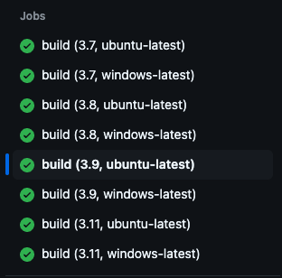
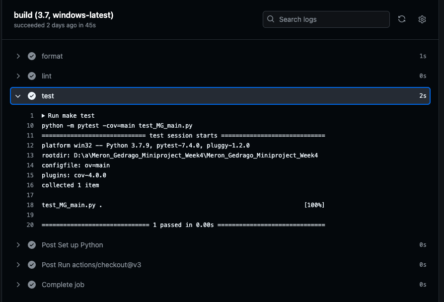

[](https://github.com/nogibjj/Meron_Gedrago_Miniproject_Week4/actions/workflows/CI.yml)

# Meron_Gedrago_miniproject4

## Aim of this project 

This project aims to edit github actions workflows to ensure that the respository works on three different versions of python.[3.7,3.8,3.9,3.11].The main edit file for this project is the github workflow CI.yml  

Please find below the verification from github that the code was run under different versions of python and passed CI/CD. 

### Screenshot 1 - passes CI/CD for the four versions of python both on os and windows



### Screenshot 2 - checking if the version ( python 3.7 on windows) to be tested is being run/tested during build 



## Structure for this project 


```
├── .devcontainer/
│   ├── devcontainer.json
│   └── Dockerfile
├── .github/
│   └── workflows/
│        └── lib.py
├── .gitignore
├── Requirements.txt
├── Makefile
├── README.md
├── MG_main.py
├── Image_1.png
├── Image_2.png
└── test_MG_main.py

```


## References 
**Previous project(s)**
- [Meron Gedrago Data Engineering mini project 1](https://github.com/nogibjj/Meron_Gedrago_miniproject1)
